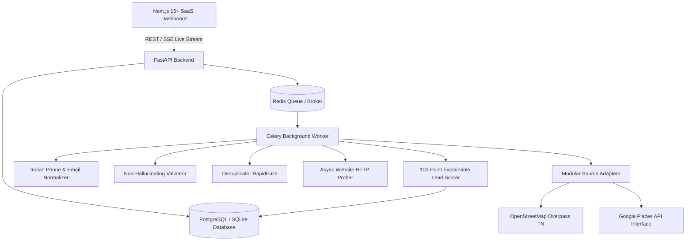

# SRA Business Lead Finder - Architecture & Technical Specification

**Brand**: SRA Software Solutions  
**Platform**: SRA Business Lead Finder  
**Tagline**: Find. Verify. Connect.

---

## 1. System Overview

SRA Business Lead Finder is an internal commercial intelligence and lead discovery platform tailored for Tamil Nadu businesses. It identifies high-opportunity commercial leads—especially businesses lacking an official web presence—verifies their contact details, eliminates duplicates, transparently scores lead qualification, and equips sales agents with CRM notes and status management.

---

## 2. Database Schema (13 Normalized Tables)

1. **`users`**: Administrative and agent credentials (hashed using bcrypt, role-based access).
2. **`categories`**: 45+ business sectors (Restaurants, Hospitals, Textiles, Bakeries, etc.).
3. **`locations`**: Hierarchical Tamil Nadu database (38 Districts, Taluks, sample Areas).
4. **`businesses`**: Core normalized business records preserving source provenance.
5. **`business_contacts`**: Normalized multi-contact persons (Name, Designation, Phone, Email).
6. **`business_social_profiles`**: Social channels (Facebook, Instagram, WhatsApp, YouTube).
7. **`scrape_jobs`**: Background job execution logs with live counters (Discovered, Valid, Duplicates, No Website, Website Found, Errors).
8. **`scrape_job_results`**: Relational junction connecting discovered businesses to jobs.
9. **`sources`**: Manageable source adapter registry (name, rate_limit, enabled toggle, terms URL).
10. **`saved_leads`**: Bookmarked leads per agent for targeted outreach.
11. **`lead_notes`**: Timestamped CRM notes thread per lead with user attribution.
12. **`lead_status_history`**: Audit trail of CRM status transitions (NEW -> CONTACTED -> INTERESTED -> CONVERTED).
13. **`audit_logs`**: System security and operational event logs.

---

## 3. Data Pipeline & Quality Rules

### Phone & Email Normalization
- **Phone**: Standardized to 10 digits (`[6-9]\d{9}`) stripping country codes (`+91`, `91`, `0`). Reject invalid numbers.
- **Email**: Strict lowercase normalization and RFC syntax validation regex.
- **Rule**: Missing fields are stored strictly as `None`/`NULL`, never hallucinated or populated with placeholder strings.

### Deduplication Engine (RapidFuzz)
Matches against existing records in three tiers:
1. **`DUPLICATE`**:
   - Exact phone match
   - Exact email match
   - RapidFuzz name ratio >= 92% and address ratio >= 70%
2. **`POSSIBLE_DUPLICATE`**:
   - Name token sort ratio >= 85% within the same district.
3. **`UNIQUE`**:
   - Clean new entry.

### Website Status Classification
Real asynchronous probe via `httpx.AsyncClient` with timeout:
- `NO_WEBSITE`: No URL provided (primary target for SRA website development).
- `WEBSITE_FOUND`: Official HTTP domain responds with 2xx/3xx.
- `SOCIAL_ONLY`: Points to Facebook, Instagram, Justdial, Indiamart, etc.
- `WEBSITE_BROKEN`: Connection refused, DNS failure, or 4xx/5xx HTTP error.

### 100-Point Explainable Lead Score
- No Official Website: **+20** (High opportunity for web dev)
- Phone Number Available: **+20** (Immediate phone outreach)
- Verified Data Source: **+20** (Legitimate commercial source)
- Email Address Available: **+15** (Direct mail outreach)
- Social Profile Available: **+15** (Digitally aware business)
- Physical Address Listed: **+10** (Established physical presence)
- **Total**: 0 to 100 points, returned with full explainable reasons list.
